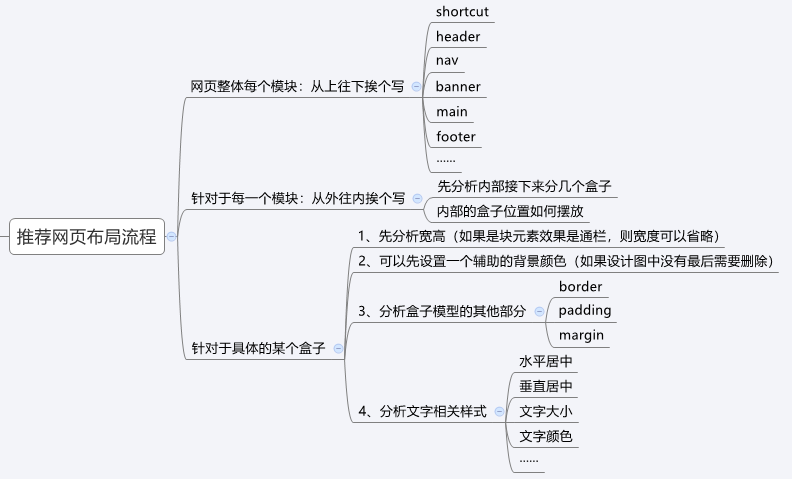

# 今日目标

- [ ] 能够使用后代选择器选择标签
- [ ] 能够说出盒子、文本水平居中的代码


# 腾讯云笔记

**项目目的：**

1. 利用目前学习的盒子模型+浮动，尝试完成简单的网页，进行中期内容的巩固；
2. 学习基础网页的布局流程，后续小兔鲜项目会补全网页的多处细节（如：ico图标、定位部分等等之类的）；
3. 一开始尝试写网页，每行代码都会，上课都能听得懂，但是听懂和独立做出了是两码事，同学们重点学习的是老师写网页的思路，而不是代码本身。

## 版心


**场景：**把页面的主体内容约束在网页中间

**作用：**让不同大小的屏幕都能看到页面的主体内容

> 因为每台电脑的屏幕不一样大，为了让不同屏幕大小的电脑都能看到页面的主体内容，我们需要把网页的内容约束在版心里。

**版心代码：**

```css
/* 版心 */
.container {
	width: 1240px;
  	margin: 0 auto;
}
/----------------------------------------------------/
/* 给主体内容的盒子设置版心，直接加上container这个类即可 */
<div class="container"></div>
```

**注意点：** 版心类名常用：`container` 、 `wrapper` 、 `w` 等


## 项目搭建

> 整个项目应该就是一个文件夹，文件夹中放项目中的所有资源（图片、html、css）

**步骤：**

1. 新建一个文件夹，作为 **项目文件夹** → 一个项目就应该有一个文件夹

2. 在项目文件夹中新建 **images文件夹** → 存放项目相关图片

3. 在项目文件夹中新建 **css文件夹** → 存放css文件

   1. 在CSS文件夹中新建 **`index.css`文件** → 样式文件
   2. 在CSS文件夹中放入准备好的 **`base.css` 文件** →样式初始化

4. 在项目文件夹中新建 **`index.html`文件** → 页面文件

   

**搭建后的项目结构：**

```
cloud
  ├── images                    # 项目的图片
  ├── css
  │   ├── index.css             # 网站首页对应样式文件
  │   └── base.css              # 网站初始化样式文件
  └── index.html                # 网页首页
```


## 样式初始化

**场景：** 一般项目开始前，首先会 **去除掉浏览器默认样式**，设置为 **当前项目需要的初始化样式**

**作用：** 防止不同浏览器中标签默认样式不同的影响，统一不同浏览器的默认显示效果，方便后续项目开发

**要求：** 已经准备好 `base.css` 代码，同学们需要认识，项目中可以直接引入使用

**初始化代码：**

```css
/* 去除常见标签默认的 margin 和 padding */
* {
  margin: 0;
  padding: 0;
}


/* 去除列表默认样式 */
ul,
ol {
  list-style: none;
}

/* 去除a标签默认下划线，并设置默认文字颜色 */
a {
  text-decoration: none;
}

/* 左浮动 */
.fl {
  float: left;
}

/* 右浮动 */
.fr {
  float: right;
}

/* 双伪元素清除法 */
.clearfix::before,
.clearfix::after {
  content: "";
  display: table;
}
.clearfix::after {
  clear: both;
}

/* 版心：宽度固定并且水平居中的盒子 */
.container {
  width: 1200px;
  margin: 0 auto;
}
```


## 推荐布局流程：



